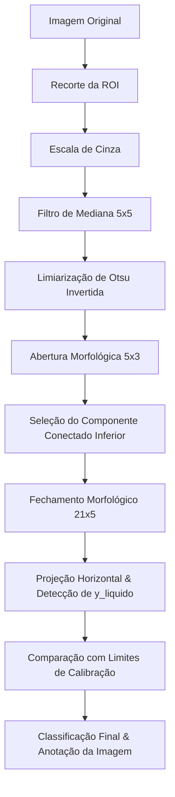

# 🍾 Sistema de Inspeção de Nível de Garrafas

Sistema de inspeção visual automatizado desenvolvido para classificação e monitoramento do nível de preenchimento de garrafas em uma linha de produção simulada. O projeto foi desenvolvido para a disciplina de **Processamento Digital de Imagens (PDI)** e visa a aplicação prática de técnicas de filtragem espacial, segmentação e processamento morfológico.

---

## 📋 Sobre o Projeto

O objetivo principal do sistema é simular o controle de qualidade industrial de envase. Ele classifica as garrafas em três categorias principais (multiclasse) ou em duas categorias de conformidade (binária):

| Situação Observada | Classe Multiclasse | Classe Binária |
| :--- | :---: | :---: |
| Líquido abaixo do limite mínimo aceitável | **Abaixo** | Defeituosa |
| Líquido dentro da faixa aceitável | **OK** | OK |
| Líquido acima do limite máximo aceitável | **Acima** | Defeituosa |

---

## Dataset

O dataset foi desenvolvido pela própria equipe sob condições controladas (fundo uniforme, iluminação estável e câmera frontal). Para adequação à tarefa de segmentação, foi utilizada uma garrafa com líquido escuro e opaco.

O conjunto de dados é composto por **16 fotos** salvas na pasta [dataset/](file:///c:/Users/Nicole Ellen/Documents/Ciencia da Computacao/6 periodo/PDI/pdi-inspecao-nivel-garrafas/dataset) divididas da seguinte forma:

*   **7 imagens de nível abaixo** (`01_abaixo.jpeg` a `07_abaixo.jpeg`)
*   **1 imagem de calibração inferior** (`08_limInf.jpeg`): define o nível mínimo aceitável.
*   **4 imagens de nível adequado (OK)** (`09_noLimite.jpeg` a `12_noLimite.jpeg`)
*   **1 imagem de calibração superior** (`13_limSup.jpeg`): define o nível máximo aceitável.
*   **3 imagens de nível acima** (`14_acima(analisar).jpeg` a `16_acima.jpeg`)

O arquivo [labels.csv](file:///c:/Users/Nicole Ellen/Documents/Ciencia da Computacao/6 periodo/PDI/pdi-inspecao-nivel-garrafas/labels.csv) contém a marcação real de cada imagem para fins de avaliação e validação das métricas.

---

## ⚙️ Pipeline de Processamento

O processamento é dividido em etapas bem definidas e modulares, permitindo a visualização dos resultados intermediários:



1.  **Região de Interesse (ROI):** Delimita a área útil da garrafa (focando no gargalo e nível de preenchimento) para eliminar interferências do fundo e otimizar a performance.
2.  **Escala de Cinza & Filtragem:** Converte a ROI para escala de cinza e aplica um **Filtro de Mediana (5x5)** para atenuar ruídos locais e reflexos no plástico sem borrar as bordas.
3.  **Segmentação (Limiarização de Otsu Invertida):** Separa o líquido (escuro) do restante da imagem, gerando uma máscara binária onde o líquido é representado em branco (255) e o fundo em preto (0).
4.  **Operações Morfológicas:**
    *   **Abertura (kernel retangular 5x3):** Remove ruídos isolados na imagem.
    *   **Seleção de Componentes Conectados:** Filtra apenas o maior componente conectado localizado na parte inferior (a massa do líquido), descartando respingos ou reflexos isolados.
    *   **Fechamento (kernel retangular 21x5):** Preenche falhas internas no líquido resultantes de reflexos de luz.
5.  **Detecção da Linha do Líquido ($y$):** Varre verticalmente a máscara e identifica onde o líquido começa pela projeção horizontal (primeira linha que inicia uma sequência de pixels brancos consecutivos).
6.  **Calibração & Classificação:** Compara a linha detectada com as linhas de referência de calibração (`08_limInf.jpeg` e `13_limSup.jpeg`). Uma tolerância de ±10 pixels é aplicada para compensar oscilações mínimas.

---

## 📂 Estrutura do Projeto

```text
pdi-inspecao-nivel-garrafas/
├── dataset/                     # Imagens originais do dataset
├── src/                         # Código-fonte do pipeline
│   ├── main.py                  # Inicialização, corte de ROI e conversão para cinza
│   ├── filtragem.py             # Filtro de mediana, segmentação Otsu e morfologia
│   ├── calibracao.py            # Detecção e salvamento dos níveis de referência
│   ├── classificacao.py         # Classificação e geração das imagens anotadas
│   └── avaliacao.py             # Geração de métricas e gráficos de avaliação
├── outputs/                     # Diretório de saídas geradas pelo pipeline
│   ├── intermediarios/          # ROIs e imagens em tons de cinza
│   ├── mascaras/                # Máscaras binárias simples e morfológicas
│   ├── finais/                  # Imagens com demarcações visuais e classificação
│   ├── calibracao.json          # Coordenadas y dos limites calibrados
│   └── resultados.csv           # Rótulos preditos pelo sistema
├── labels.csv                   # Rótulos reais das imagens
├── matriz_confusao.png          # Gráfico de avaliação de desempenho
└── README.md                    # Documentação do projeto
```

---

## 🚀 Como Executar

### 1. Requisitos
Certifique-se de ter o Python 3 instalado, junto com as seguintes dependências:
```bash
pip install opencv-python numpy matplotlib
```

### 2. Executando o Pipeline Completo
Para executar todas as etapas sequencialmente e gerar os relatórios e imagens de saída, basta executar os scripts na seguinte ordem:

```bash
# 1. Extração da ROI e tons de cinza
python src/main.py

# 2. Filtragem e geração das máscaras morfológicas
python src/filtragem.py

# 3. Execução da calibração a partir das imagens de referência
python src/calibracao.py

# 4. Classificação das imagens de teste
python src/classificacao.py

# 5. Avaliação do desempenho (matrizes de confusão e acurácia)
python src/avaliacao.py
```

---

## 📊 Resultados e Avaliação

Após processar as imagens de teste, o sistema alcançou as seguintes métricas de desempenho:

*   **Acurácia Multiclasse:** **93.75%** (15 de 16 imagens classificadas corretamente)
*   **Acurácia Binária (Conformidade):** **93.75%** (15 de 16 imagens classificadas corretamente)

### Matriz de Confusão Multiclasse
O único caso de erro foi a imagem `14_acima(analisar).jpeg` (caso limítrofe/borda), que foi rotulada como **Acima** no dataset real, mas classificada como **OK** pelo sistema devido à margem de tolerância.

```text
              Previsão
            | Abaixo |  OK  | Acima |
Real  Abaixo|   7    |   0  |   0   |
      OK    |   0    |   6  |   0   |
      Acima |   0    |   1  |   2   |
```

O gráfico contendo as matrizes de confusão geradas pode ser visualizado em [matriz_confusao.png](file:///c:/Users/Nicole Ellen/Documents/Ciencia da Computacao/6 periodo/PDI/pdi-inspecao-nivel-garrafas/matriz_confusao.png).

